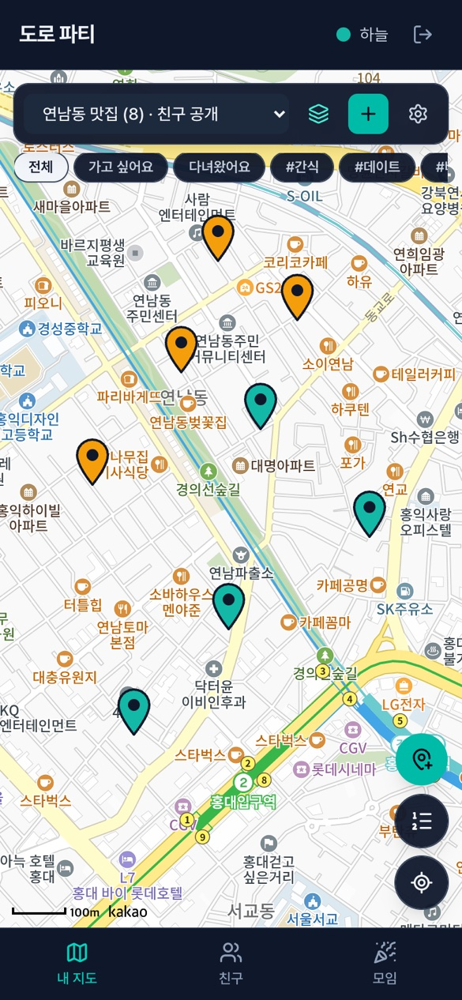
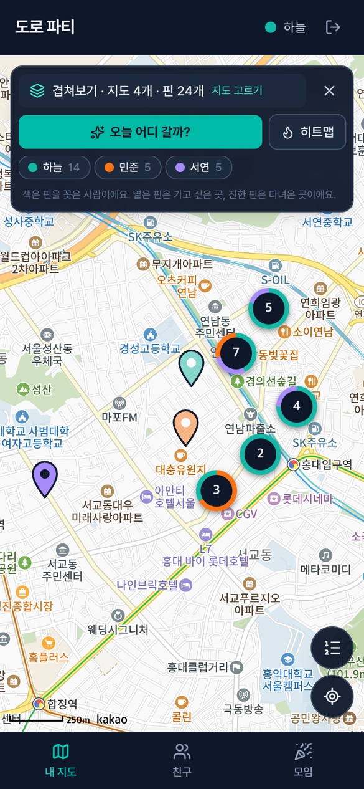
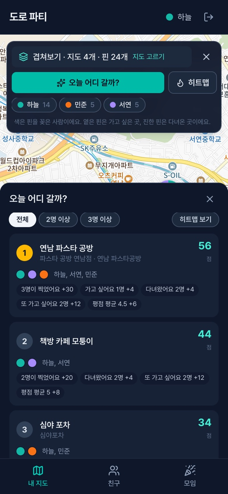
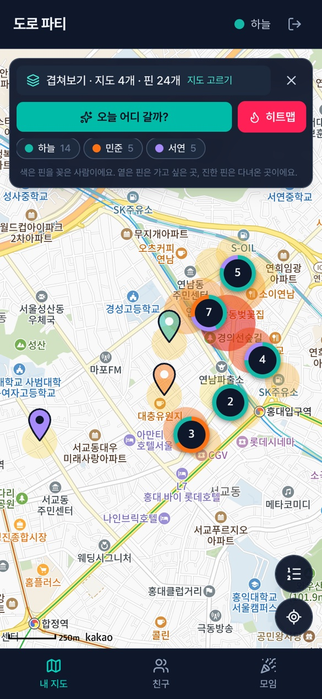
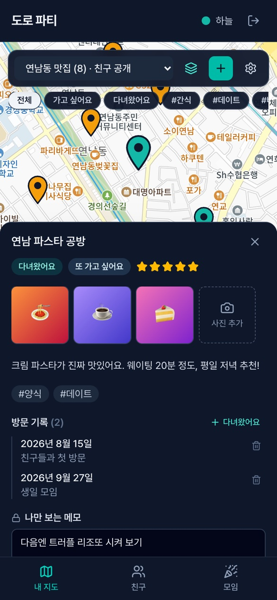
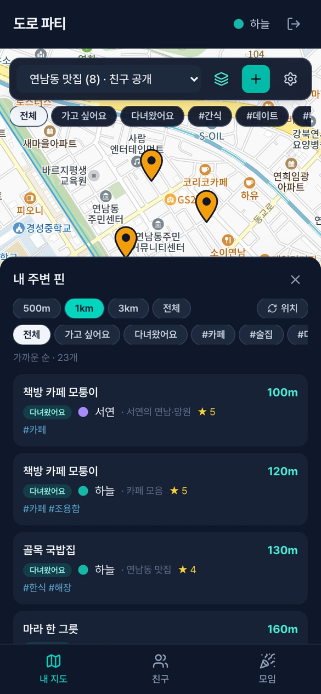
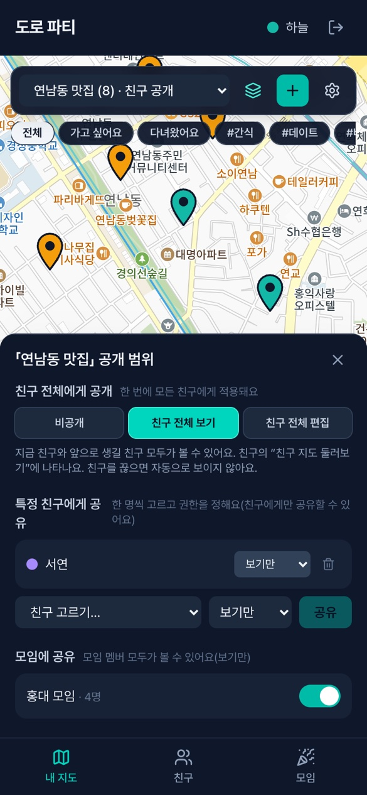
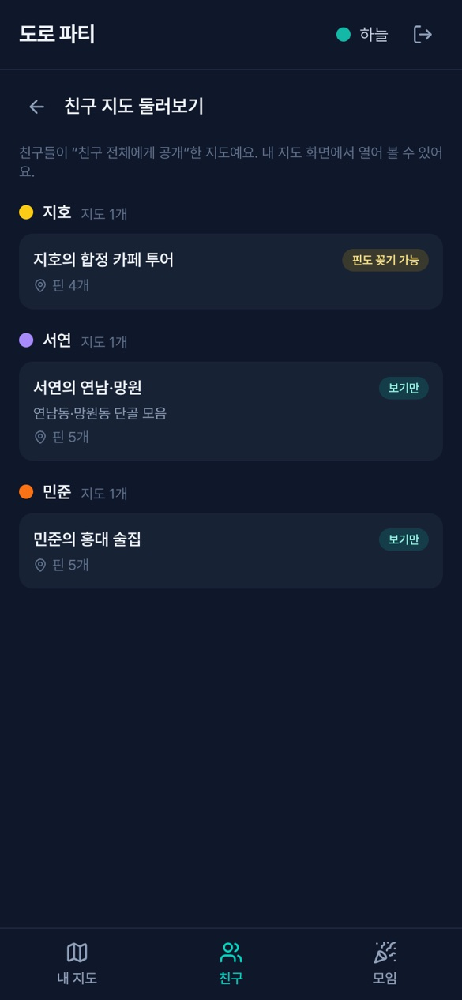
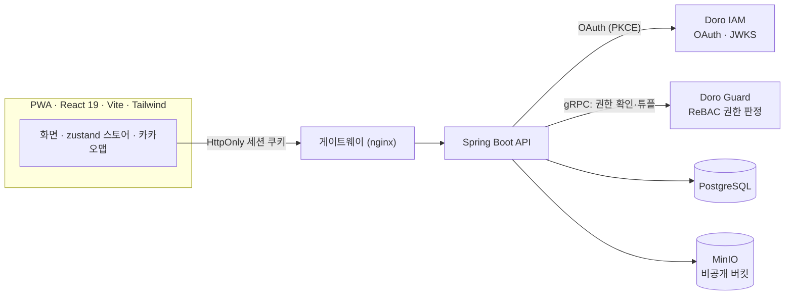

# 도로 파티 (Doro Party)

[](https://github.com/yu-teacher/doro-party/actions/workflows/ci.yml)

**친구들과 각자 만든 지도를 겹쳐 보고 "오늘 어디 가지?"를 정하는 모바일 우선 PWA.**
내 지도에 가고 싶은 곳, 다녀온 곳을 직접 핀으로 꽂고, 친구·모임과 공유해서 한 화면에 겹쳐 봅니다.
여러 명이 찍은 곳은 **점수와 근거(왜 높은지)** 와 함께 추천해 줍니다.
[Doro 플랫폼](https://github.com/yu-teacher/doro)(IAM·Guard·SDK) 위의 서브 서비스입니다.

<table>
  <tr>
    <td align="center"><br><sub><b>내 지도</b><br>핀·상태·태그 필터</sub></td>
    <td align="center"><br><sub><b>겹쳐보기</b><br>작성자 색·가까운 핀 묶음</sub></td>
    <td align="center"><br><sub><b>오늘 어디 갈까?</b><br>점수와 근거</sub></td>
    <td align="center"><br><sub><b>히트맵</b><br>모이는 곳 한눈에</sub></td>
  </tr>
  <tr>
    <td align="center"><br><sub><b>핀 상세</b><br>사진·방문 기록·나만 보는 메모</sub></td>
    <td align="center"><br><sub><b>내 주변 핀</b><br>가까운 순, 반경·태그 필터</sub></td>
    <td align="center"><br><sub><b>공개 범위</b><br>친구 전체 / 특정 친구 / 모임</sub></td>
    <td align="center"><br><sub><b>친구 지도 둘러보기</b><br>친구가 공개한 지도</sub></td>
  </tr>
</table>

> 스크린샷은 더미 데이터로 만든 화면입니다. 지도는 카카오맵을 사용합니다.

## 기능
- **내 지도**: 지도를 여러 개 만들고, 지도 위를 눌러 핀을 꽂습니다. 이름·메모·상태(가고 싶은 곳/다녀온 곳)·별점·태그·재방문 의사.
- **개인 기록**: 사진(업로드 전에 줄임), 방문 기록 타임라인, **나만 보는 메모**(공유 응답에 절대 포함되지 않음).
- **친구·모임**: 초대 링크 또는 사용자명으로 친구 맺기, 카카오톡방처럼 만드는 모임(방장/멤버).
- **공유와 공개 범위**: 지도를 **친구 전체**(지금 친구와 앞으로 생길 친구 모두, 보기/편집)·**특정 친구**·**모임**에 공개. 친구를 끊거나 모임을 나가면 접근이 자동으로 사라집니다.
- **겹쳐보기**: 여러 지도를 작성자 색으로 한 화면에, 가까운 핀은 묶어서. 작성자별로 켜고 끌 수 있습니다.
- **오늘 어디 갈까?**: "N명이 찍은 곳"을 규칙 기반으로 점수화해 순위와 **점수 내역**을 보여 주고, 특정 사람을 빼고 다시 계산하거나 히트맵으로 볼 수 있습니다.
- **내 주변 핀**: 내 위치에서 가까운 순으로 모든 지도의 핀을 보여 줍니다. 위치는 서버로 보내지 않고 기기 안에서만 계산합니다.
- **PWA**: 홈 화면에 설치. 앱 껍데기만 캐시하고 개인 데이터는 캐시하지 않습니다.

## 설계 하이라이트
- **권한은 Guard(ReBAC)가 판정**합니다. 지도 접근은 `party_map` 관계 튜플로만 결정하고, 모임·친구는 **사용자 집합(userset)** 으로 걸어서 멤버·친구가 바뀌어도 지도 쪽 튜플을 고치지 않습니다(멤버십 변경 = 접근 변경).
  ```
  type party_friends { relation friend: user }
  type party_map {
    relation owner: user
    relation editor: owner | user | party_friends#friend
    relation viewer: editor | user | party_group#member | party_friends#friend
  }
  ```
- **DB가 원본, Guard는 그에 맞춘 사본**: 공유·멤버십 상태는 DB에 두고 Guard 튜플은 같은 트랜잭션에서 쓰고(실패하면 함께 롤백) 지울 때는 커밋 뒤에 지웁니다.
- **BFF 로그인**: 서버가 OAuth 토큰(PKCE)을 들고 브라우저에는 HttpOnly 세션 쿠키만 줍니다. CSRF 헤더 검증, 토큰은 암호화해 저장합니다.
- **설명 가능한 추천**: 점수 계산은 DB·권한과 무관한 순수 함수이고, 응답에 항목별 점수 내역을 담습니다.
  `점수 = 사람 수×10 + 가고 싶음×4 + 다녀옴×2 + "또 가고 싶음"×6 + "한 번이면 충분"×(−4) + Σ(별점−3)×2` (가중치는 환경변수로 조정)
- **사진은 비공개 버킷**(MinIO)에 두고, 권한을 확인한 백엔드만 내려줍니다. 형식은 파일의 첫 바이트로 판별합니다(JPEG·PNG·WebP).
- **동시성**: 행 잠금과 `ON CONFLICT` 원자 쿼리로 개수 상한·친구 쌍 같은 경합을 막습니다.

## 아키텍처


백엔드는 도메인 패키지(`auth · user · map · pin · share · friend · group · overlay · recommendation`) 안에서 Controller → Service → Repository 로 나눕니다. 자세한 설계는 [docs/DESIGN.md](docs/DESIGN.md).

## 기술 스택
| 영역 | 사용 기술 |
|---|---|
| 백엔드 | Java 25, Spring Boot 4, Spring Data JPA, Flyway, gRPC(Guard), Doro SDK |
| 프런트 | React 19, TypeScript, Vite 6, Tailwind 4, zustand, vite-plugin-pwa, 카카오맵 JS SDK |
| 저장소 | PostgreSQL(원본), MinIO(사진) |
| 품질 | 백엔드 통합 테스트 179개(실제 Guard·DB·MinIO), 프런트 테스트 164개(vitest), ESLint 규칙으로 금지 패턴 강제 |
| 배포 | Docker, GitHub Actions(CI → 자체 호스팅 러너 배포, 롤백 스냅샷·DB 백업·자동 복구) |

## 구성
| 위치 | 내용 |
|---|---|
| `src/` | Spring Boot 백엔드 (Doro OAuth BFF 로그인, Guard ReBAC, Flyway) |
| `web/` | React + Vite PWA (카카오맵), `/party/` 하위 경로에 마운트 |
| `deploy/` | 게이트웨이(nginx) 설정 조각 |
| `scripts/` | CI 테스트, 서버 준비·게이트웨이 반영·배포 스크립트 |
| `docs/` | [설계](docs/DESIGN.md) · [배포](docs/DEPLOY.md) |

## 개발
```bash
cp .env.example .env            # 값 채우기
./gradlew test                  # 백엔드 테스트 (로컬 Doro 스택 필요: Postgres, Guard)
./gradlew bootRun               # API :8086
cd web && npm ci && npm run dev # 웹 :3005 → http://localhost:3005/party/
scripts/ci-test.sh              # CI 와 같은 검증(격리된 Postgres/Guard/S3 스택을 올리고 테스트)
```
`VITE_KAKAO_MAP_APP_KEY` 가 없으면 지도 대신 안내가 표시됩니다(`web/.env.local` 에 둡니다. 커밋되지 않습니다).

### 로컬에서 로그인까지 써보기
운영에서는 게이트웨이가 `/oauth2/consent` 를 포털로 연결하지만 로컬에는 게이트웨이가 없습니다.
로컬 Doro 의 포털 개발 컨테이너(3010)가 IAM 프록시와 로그인 화면을 함께 서빙하므로, 인가 주소만 그쪽으로 돌립니다.
```bash
PARTY_OAUTH_AUTHORIZE_URL=http://localhost:3010/oauth2/authorize PARTY_COOKIE_SECURE=false ./gradlew bootRun
```
로컬 IAM 에 OAuth 클라이언트 `doro-party`(redirect URI `http://localhost:3005/party/api/v1/bff/callback`, 자사 앱)를 등록해 두어야 합니다.
