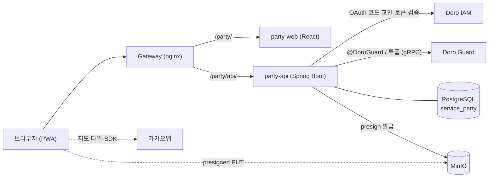

# 도로 파티 (Doro Party) 설계

> 친구들과 각자 만든 지도를 겹쳐 보고 "오늘 어디 가지?"를 정하는 서비스.
> Doro 플랫폼(IAM·Guard·SDK) 위의 두 번째 서브 서비스이며, 첫 번째는 [doro-blog](https://github.com/yu-teacher/doro-blog)입니다.

## 1. 컨셉

- 사람마다 **주제별 지도 여러 개**를 갖고, 지도 위에 **핀을 직접 꽂아** 장소를 기록한다(장소 검색이 아니라 좌표 + 내 기록).
- 지도는 친구에게 **viewer / editor** 로 공유한다.
- 모임을 정하면 참여자의 지도를 **한 화면에 겹쳐** 보고, "N명이 찍은 곳"을 추천받는다.
- 모바일 우선 **PWA**. 링크로 들어와 설치 없이 쓴다.

### 핵심 시나리오
1. 홍대에 갈 친구 3명을 고르거나 모임을 만든다.
2. 각자 공유한 지도가 레이어로 합쳐지고 핀은 작성자 색으로 구분된다.
3. 여러 명이 찍은 곳이 강조되고 추천 순위가 나온다.
4. 장소를 탭하면 친구별 메모·평점·방문 기록이 보인다.

### 결정 사항

| 영역 | 결정 |
|---|---|
| 플랫폼 | 모바일 우선 PWA (네이티브 앱과 비교 후 선택: 설치 장벽 없음, Doro 웹 스택 재사용) |
| 지도 | 카카오맵 JS SDK (한국 상호명 표시). 사용자 핀은 자체 좌표·메모만 저장, 외부 장소 데이터는 저장하지 않음 |
| 핀 | 이름·메모(필수), 태그, 사진, 평점, 상태(WISH/VISITED) |
| 개인 기록 | 방문 기록 타임라인, 사적/공유 메모 분리, 재방문 의사 |
| 지도 단위 | 사람당 여러 지도, 공유는 지도 단위 |
| 관계 | 친구 목록(상호 승인) + 즉석 모임/영구 그룹 |
| 겹쳐보기 | 레이어 토글(기본) + 모임 전용 뷰, 작성자 항상 표시, 가까운 핀은 거리 기준 클러스터링 |
| 추천 | 규칙 기반 점수 + 히트맵 |
| 인증/인가 | Doro OAuth(BFF 세션 쿠키), 지도 권한은 Guard ReBAC |
| 사진 | MinIO 비공개 버킷에 저장하고, 권한(Guard)을 확인한 백엔드가 올리고 내려준다 |

## 2. 아키텍처



### doro-blog 와 맞춘 규약
- 백엔드: Java 25, Spring Boot 4, JPA, Flyway(`party_schema_history`), `ddl-auto: validate`.
- 프런트: React 19, Vite, TypeScript, zustand, ESLint로 AGENTS.md 규칙 강제.
- `includeBuild('../Doro')` 로 Doro SDK 사용. 응답 봉투·`GlobalExceptionHandler`·`GuardTuples` 패턴(DB 트랜잭션 안에서 튜플 쓰기, 실패 시 보상)을 따른다.
- 로그인은 BFF: 브라우저에는 HttpOnly 세션 쿠키만, 토큰은 서버에 암호화 보관, 상태 변경 요청은 CSRF 헤더 필요.

### 게이트웨이 라우팅 (중요)
`doro-blog` 는 게이트웨이의 `/api/v1/` 전체를 가져가므로 도로 파티는 같은 경로를 쓸 수 없다. **하위 경로 마운트**를 쓴다.

| 경로 | 대상 |
|---|---|
| `/party/` | party-web (SPA, `basename="/party"`, Vite `base="/party/"`) |
| `/party/api/` | party-api (프록시에서 `/party` 제거 후 `/api/v1/...` 로 전달) |

새 `location` 은 블로그의 `/api/v1/` 보다 먼저 선언한다. 게이트웨이 설정은 CI가 배포하지 않으므로 수동 반영 + `nginx -t` + reload.
PWA는 service worker 때문에 **HTTPS 필수**이고, 카카오맵 JS 키는 사이트 도메인 등록이 필요하다. CSP에 `dapi.kakao.com`, 타일 도메인 허용을 추가한다.

## 3. 데이터 모델 (DB `service_party`)

| 테이블 | 컬럼 요점 |
|---|---|
| `party_user` | id, doro_user_id(unique), nickname, color |
| `party_map` | id, owner_id, name, description, created_at |
| `pins` | id, map_id, created_by, lat, lng, name, shared_memo, status(WISH/VISITED), rating(1..5, null), revisit_intent(AGAIN/ONCE/null), created_at |
| `pin_private_notes` | (pin_id, user_id), body — 쓴 사람 본인에게만 보인다 |
| `pin_tags` | pin_id, tag |
| `pin_photos` | id, pin_id, uploaded_by, object_key, content_type(서버가 판별), size_bytes |
| `visit_logs` | id, pin_id, user_id, visited_on, note |
| `friendship` | id, requester_id, addressee_id, status(PENDING/ACCEPTED), 양방향 중복 방지 유니크 |
| `party_group` | id, owner_id, name, persistent(bool) |
| `party_group_member` | group_id, user_id |

원칙:
- 사적 메모는 `pin` 과 분리된 테이블로 두어 응답 매핑 실수로 인한 노출을 구조적으로 막는다.
- 좌표는 `lat/lng` 복합 인덱스로 시작. 서버 측 공간 질의가 필요해지면 PostGIS를 별도 마이그레이션으로 추가한다.
- 사진은 DB에 `object_key` 만 저장. 핀당 장수·용량 상한은 환경변수.
- 모든 DDL은 Flyway `V{n}__*.sql`.

## 4. 권한 (Guard 스키마)

```
type party_map {
  relation owner: user
  relation editor: user
  relation viewer: user
  permission edit = owner + editor
  permission view = edit + viewer
}
```

실제 DSL 문법은 Doro가 지원하는 형태(`blog-schema.doro` 참조)에 맞춰 작성하고, **전역 단일 스키마이므로 `GET` 으로 받은 활성 DSL에 병합해 `POST`** 한다(`BlogSchemaMerger` 패턴).

- 친구 관계·모임은 "누구에게 공유할지"를 고르는 수단이고, 실제 접근 판정은 `party_map` 튜플만 쓴다.
- 지도를 모임에 공유하면 멤버별 튜플을 쓴다(초기 방식). 모임 멤버 변경 시 튜플 동기화가 필요하며, Guard가 userset 참조를 지원하면 이후 전환을 검토한다.
- **겹쳐보기는 내가 `view` 권한을 가진 지도만 대상**으로 한다. 친구라도 공유하지 않은 지도는 보이지 않는다.
- 친구 해제 시 해제한 쪽이 준 공유 권한은 회수한다(기본 정책, 구현 전 재확인).
- 핀 수정·삭제는 "내가 꽂은 핀" 또는 "지도 주인"만 할 수 있다(editor 가 남의 핀을 고치지 못하게). 지도 수정·삭제는 owner 만 가능하다.
- 개수 상한(지도 50/사용자, 핀 2000/지도, 태그 10/핀)은 환경변수로 조정하며, 동시 요청에서도 지켜지도록 사용자·지도 행을 잠근 뒤 센다.

## 5. API 초안 (`/api/v1`, 공통 응답 봉투)

| 영역 | 엔드포인트 |
|---|---|
| 세션(BFF) | `GET /bff/login`, `GET /bff/callback`, `POST /bff/logout`, `GET /bff/session` |
| 지도 | `POST/GET /maps`, `GET/PATCH/DELETE /maps/{id}`, `PUT/DELETE /maps/{id}/shares/{userId}` |
| 핀 | `POST/GET /maps/{id}/pins`(GET 은 `status`, `tag` 필터), `PUT·PATCH/DELETE /maps/{id}/pins/{pinId}` — 핀은 항상 지도 경로 아래에서만 접근한다(지도 권한 = 핀 권한, 다른 지도의 핀 ID 로 접근하는 IDOR 방지) |
| 방문 기록 | `POST/GET /maps/{id}/pins/{pinId}/visits`, `DELETE .../visits/{visitId}` |
| 사적 메모 | `GET /maps/{id}/private-notes`(내 것 전체), `PUT/DELETE /maps/{id}/pins/{pinId}/private-note` |
| 사진 | `POST/GET /maps/{id}/pins/{pinId}/photos`(multipart `file`), `GET .../photos/{photoId}/content`, `DELETE .../photos/{photoId}` |
| 친구 | `POST /friends/requests`, `POST /friends/requests/{id}/accept`, `GET /friends` |
| 모임 | `POST/GET /groups`, `PUT/DELETE /groups/{id}/members/{userId}` |
| 겹쳐보기 | `GET /overlay?mapIds=...` (보기 권한이 있는 지도만 반환) |
| 추천 | `GET /groups/{id}/recommendations`, `GET /overlay/recommendations?mapIds=...` |

목록 파라미터는 `PageLimits` 로 상한을 둔다. 에러는 사전 정의된 코드로 표준 에러 규격을 반환한다.

## 6. 사진 (MinIO, 비공개)

위치 기록 사진은 지도의 공유 범위를 따라야 하므로, 버킷을 공개하지 않고 **권한을 확인한 백엔드만** 올리고 내려준다.

1. 앱이 사진을 줄여서(리사이즈·압축) `multipart` 로 올린다. 인증은 파일을 읽기 전에 검사한다(비로그인이 큰 파일을 올리지 못하게).
2. 서버가 지도 권한(editor)과 핀 규칙(내가 꽂은 핀 또는 지도 주인), 개수·크기 상한을 확인한다.
3. **형식은 파일의 첫 바이트로 판별**한다(JPEG·PNG·WebP 만). 클라이언트가 보낸 확장자와 Content-Type 은 믿지 않고, SVG·GIF·HTML 은 받지 않는다.
4. 파일을 먼저 스토리지에 올리고 DB 에 기록한다. DB 가 롤백되면 올린 파일을 지워 고아 파일이 남지 않게 한다.
5. 내려줄 때는 지도 보기 권한(viewer)을 확인한 뒤 `private` 캐시, `nosniff` 헤더와 함께 스트리밍한다. 공개 URL 이 없다.
6. 핀·지도·사진을 지우면 DB 삭제가 커밋된 뒤에 스토리지 파일을 지운다(실패하면 ERROR 로그로 남긴다).

presigned URL 직접 업로드 대신 이 방식을 고른 이유: 서버가 파일 내용을 직접 검증할 수 있고, 확정되지 않은 업로드 객체를 정리하는 작업과 게이트웨이 서명 문제가 없으며, 친구들과 쓰는 규모에서는 서버 경유 비용이 무시할 만하다.

## 7. 클러스터링과 추천

- **클러스터링**: 클라이언트(카카오맵 클러스터러). 클러스터 배지는 "N명".
- **추천 점수**: `찍은 인원 수 × w1 + 위시 상태 가산 + 재방문 의사 가산 + 평점 평균 × w2`. 가중치는 상수로 분리하고, 점수 산출 근거(어떤 항목이 몇 점)를 응답에 포함해 설명 가능하게 한다.
- **히트맵**: 선택 지도 핀 좌표로 클라이언트가 그린다.

## 8. 마일스톤

| 단계 | 내용 | 완료 기준 |
|---|---|---|
| **M0 기반** | 서비스 골격, DB·Flyway, SDK/Guard 연동, OAuth 로그인(BFF), 도커·배포, PWA 셸 | 서버 `healthy` + 로그인 성공 + 빈 지도 표시 |
| **M1 개인 지도** | 지도 CRUD, 핀 꽂기/수정(이름·메모·상태·태그·평점) | 폰에서 핀 저장·조회 |
| **M2 기록** | 사진(MinIO), 방문 기록, 사적/공유 메모, 재방문 의사 | 사진 포함 핀 생성 |
| **M3 공유** | 친구 요청/승인, 지도 viewer/editor 공유, Guard 튜플 | 친구가 내 지도를 열람 |
| **M4 겹쳐보기** | 레이어 토글, 작성자 색상, 클러스터링 | 친구 3명 지도 합쳐보기 |
| **M5 모임·추천** | 즉석/영구 모임, 점수 추천, 히트맵 | 실제 친구들과 사용 |

M4까지가 "쓸 만한 서비스"의 기준선이다. 각 단계는 테스트 통과 → 빌드 → 서버 기동 `healthy` 확인 후 다음으로 넘어간다.

### M0 체크리스트 (Doro New Service Blueprint 대응)
1. **DB**: Doro `docker-compose.yml`·`.env.example`·`init-db` 의 `POSTGRES_MULTIPLE_DATABASES` 에 `service_party` 추가, Flyway `party_schema_history`, `ddl-auto: validate`.
2. **SDK/인증**: `includeBuild('../Doro')`, JWKS·Guard gRPC 설정, BFF 로그인, `@CurrentDoroUser`, 서비스별 Guard 토큰 발급.
3. **Guard 스키마**: `party_map` 병합 등록(`PartySchemaInitializer`/`Merger`).
4. **오케스트레이션**: compose에 `party-api`·`party-web` 추가(`doro-network`), MinIO 버킷 `doro-party-media`, 로그는 stdout, `X-Trace-Id` 전파.
5. **배포 검증**: 게이트웨이 `/party/` 라우트 반영, OAuth 클라이언트(`doro-party`) 등록, 서버에서 `healthy` 확인.
6. **PWA 셸**: manifest, service worker(앱 셸만 캐시, API는 네트워크 우선), 카카오맵 지도 표시.

## 9. 환경변수 (예시)

`DB_HOST/DB_PORT/DB_NAME=service_party/DB_USER/DB_PASSWORD`, `IAM_HOST/IAM_PORT`, `GUARD_GRPC_HOST/PORT`, `GUARD_HTTP_HOST/PORT`, `DORO_GUARD_SERVICE_TOKEN`, `MINIO_ENDPOINT/ACCESS_KEY/SECRET_KEY/BUCKET=doro-party-media`, `PARTY_OAUTH_CLIENT_ID=doro-party`, `PARTY_OAUTH_REDIRECT_URI`, `PARTY_SESSION_KEY`(base64 32바이트, 기본값 없음), `PARTY_COOKIE_SECURE`, 프런트 `VITE_KAKAO_MAP_APP_KEY`. 비밀값은 `.env` 로만 관리하고 `.env.example` 에는 자리표시자만 둔다.

포트: party-api `8086`, party-web `3005`(Doro·blog·menu·sebi-wht·로컬의 다른 컨테이너가 쓰는 8080~8085, 8090, 3000~3004 와 겹치지 않음).
