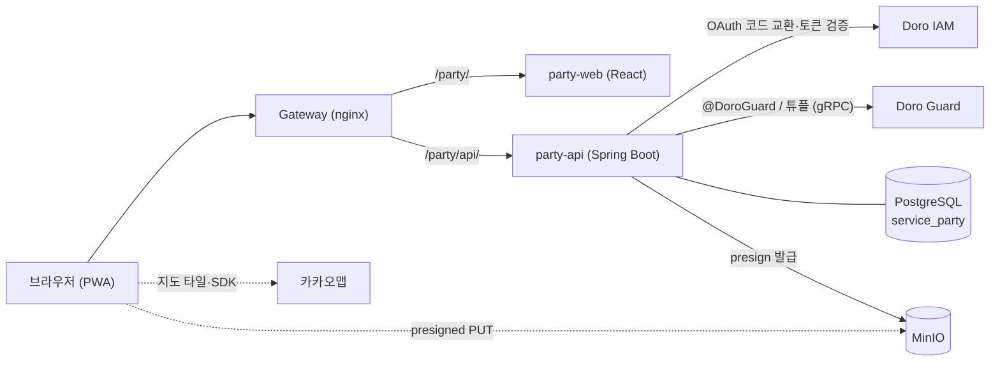

# 도로 파티 (Doro Party) 설계

> 친구들과 각자 만든 지도를 겹쳐 보고 "오늘 어디 가지?"를 정하는 서비스.
> Doro 플랫폼(IAM·Guard·SDK) 위의 두 번째 서브 서비스이며, 첫 번째는 [doro-blog](https://github.com/yu-teacher/doro-blog)입니다.

## 1. 컨셉

- 사람마다 **주제별 지도 여러 개**를 갖고, 지도 위에 **핀을 직접 꽂아** 장소를 기록한다(장소 검색이 아니라 좌표 + 내 기록).
- 지도는 친구에게 **viewer / editor** 로 공유한다.
- 모임을 정하면 참여자의 지도를 **한 화면에 겹쳐** 보고, "N명이 찍은 곳"을 추천받는다.
- 모바일 우선 **PWA**. 링크로 들어와 설치 없이 쓴다.

### 핵심 시나리오
1. 홍대에 갈 친구 3명을 고르거나 모임을 만든다.
2. 각자 공유한 지도가 레이어로 합쳐지고 핀은 작성자 색으로 구분된다.
3. 여러 명이 찍은 곳이 강조되고 추천 순위가 나온다.
4. 장소를 탭하면 친구별 메모·평점·방문 기록이 보인다.

### 결정 사항

| 영역 | 결정 |
|---|---|
| 플랫폼 | 모바일 우선 PWA (네이티브 앱과 비교 후 선택: 설치 장벽 없음, Doro 웹 스택 재사용) |
| 지도 | 카카오맵 JS SDK (한국 상호명 표시). 사용자 핀은 자체 좌표·메모만 저장, 외부 장소 데이터는 저장하지 않음 |
| 핀 | 이름·메모(필수), 태그, 사진, 평점, 상태(WISH/VISITED) |
| 개인 기록 | 방문 기록 타임라인, 사적/공유 메모 분리, 재방문 의사 |
| 지도 단위 | 사람당 여러 지도, 공유는 지도 단위 |
| 관계 | 친구(초대 링크로 바로, 사용자명 요청은 상대 승인) + 모임(카톡방처럼 링크·친구 초대로 들어오는 영구 그룹, 방장/멤버) |
| 겹쳐보기 | 레이어 토글(기본) + 모임 전용 뷰, 작성자 항상 표시, 가까운 핀은 거리 기준 클러스터링 |
| 추천 | 규칙 기반 점수 + 히트맵 |
| 인증/인가 | Doro OAuth(BFF 세션 쿠키), 지도 권한은 Guard ReBAC |
| 사진 | MinIO 비공개 버킷에 저장하고, 권한(Guard)을 확인한 백엔드가 올리고 내려준다 |

## 2. 아키텍처



### doro-blog 와 맞춘 규약
- 백엔드: Java 25, Spring Boot 4, JPA, Flyway(`party_schema_history`), `ddl-auto: validate`.
- 프런트: React 19, Vite, TypeScript, zustand, ESLint로 AGENTS.md 규칙 강제.
- `includeBuild('../Doro')` 로 Doro SDK 사용. 응답 봉투·`GlobalExceptionHandler`·`GuardTuples` 패턴(DB 트랜잭션 안에서 튜플 쓰기, 실패 시 보상)을 따른다.
- 로그인은 BFF: 브라우저에는 HttpOnly 세션 쿠키만, 토큰은 서버에 암호화 보관, 상태 변경 요청은 CSRF 헤더 필요.

### 게이트웨이 라우팅 (중요)
`doro-blog` 는 게이트웨이의 `/api/v1/` 전체를 가져가므로 도로 파티는 같은 경로를 쓸 수 없다. **하위 경로 마운트**를 쓴다.

| 경로 | 대상 |
|---|---|
| `/party/` | party-web (SPA, `basename="/party"`, Vite `base="/party/"`) |
| `/party/api/` | party-api (프록시에서 `/party` 제거 후 `/api/v1/...` 로 전달) |

새 `location` 은 블로그의 `/api/v1/` 보다 먼저 선언한다. 게이트웨이 설정은 CI가 배포하지 않으므로 수동 반영 + `nginx -t` + reload.
PWA는 service worker 때문에 **HTTPS 필수**이고, 카카오맵 JS 키는 사이트 도메인 등록이 필요하다. CSP에 `dapi.kakao.com`, 타일 도메인 허용을 추가한다.

## 3. 데이터 모델 (DB `service_party`)

| 테이블 | 컬럼 요점 |
|---|---|
| `party_user` | id, doro_user_id(unique), nickname, color |
| `party_map` | id, owner_id, name, description, **friend_access**(NONE/VIEWER/EDITOR, 기본 NONE — 친구 전체에게 공개하는 범위), created_at |
| `pins` | id, map_id, created_by, lat, lng, name, shared_memo, status(WISH/VISITED), rating(1..5, null), revisit_intent(AGAIN/ONCE/null), created_at |
| `pin_private_notes` | (pin_id, user_id), body — 쓴 사람 본인에게만 보인다 |
| `pin_tags` | pin_id, tag |
| `pin_photos` | id, pin_id, uploaded_by, object_key, content_type(서버가 판별), size_bytes |
| `visit_logs` | id, pin_id, user_id, visited_on, note |
| `party_users` | id(Doro 사용자 ID), username(친구가 나를 찾는 이름, 본인이 수정), nickname, color — 이메일은 저장하지 않는다 |
| `friendships` | 정렬된 (user_low_id, user_high_id) 유니크, requester_id, status(PENDING/ACCEPTED) |
| `friend_invites` | owner_id 당 하나, code_hash, code_enc(암호화), expires_at |
| `map_user_shares` | (map_id, user_id), role(VIEWER/EDITOR) — 친구에게 공유 |
| `party_groups` / `party_group_members` | 모임, (group_id, user_id) + role(OWNER/MEMBER), 방장은 모임마다 한 명 |
| `group_invites` | group_id 당 하나(친구 초대 링크와 같은 방식) |
| `map_group_shares` | (map_id, group_id), shared_by — 내 지도를 모임에 공유(모임 멤버 모두 viewer) |

원칙:
- 사적 메모는 `pin` 과 분리된 테이블로 두어 응답 매핑 실수로 인한 노출을 구조적으로 막는다.
- 좌표는 `lat/lng` 복합 인덱스로 시작. 서버 측 공간 질의가 필요해지면 PostGIS를 별도 마이그레이션으로 추가한다.
- 사진은 DB에 `object_key` 만 저장. 핀당 장수·용량 상한은 환경변수.
- 모든 DDL은 Flyway `V{n}__*.sql`.

## 4. 권한 (Guard 스키마)

```
type party_group {
  relation owner: user
  relation member: owner | user
}

# 사용자 한 명의 친구 목록(객체 ID = 그 사용자). "친구 전체에게 공개"가 이 집합을 가리킨다.
type party_friends {
  relation friend: user
}

type party_map {
  relation owner: user
  relation editor: owner | user | party_friends#friend
  relation viewer: editor | user | party_group#member | party_friends#friend
}
```

실제 DSL 은 `src/main/resources/party-schema.doro` 이고, **전역 단일 스키마이므로 `GET` 으로 받은 활성 DSL 에 병합해 `POST`** 한다. 다른 서비스의 타입은 건드리지 않고, `party_*` 타입은 없으면 덧붙이고 내용이 바뀌었으면 제자리에서 교체한다(`PartySchemaMerger`).

- **지도 접근은 `party_map` 튜플만으로 판정**한다. 친구·모임은 "누구에게 공유할지"를 고르는 수단이다.
- 친구에게 공유 = `party_map:M#editor|viewer@user:U`. 모임에 공유 = `party_map:M#viewer@party_group:G#member`(사용자 집합).
  멤버가 들고 나면 `party_group:G#member@user:U` 튜플만 바뀌고 지도 쪽 튜플은 그대로이므로, **멤버십 변경이 곧 접근 변경**이다(실제 Guard 로 검증).
- **친구 전체에게 공개** = `party_map:M#viewer|editor@party_friends:<주인>#friend`(사용자 집합) 하나. 두 사람이 친구가 되면 서로의 `party_friends` 목록에 서로를 넣고(`party_friends:A#friend@user:B`),
  끊으면 뺀다. 그래서 **새 친구에게 자동 적용되고, 끊으면 자동 회수**되며 공개한 지도들의 튜플은 건드리지 않는다. 처음 공개할 때는 이 기능 이전에 맺은 친구가 목록에 없을 수 있어 주인의 친구 목록을 DB 기준으로 한 번 채운다.
  범위(NONE/VIEWER/EDITOR)는 `party_maps.friend_access` 가 원본이다. 직접 공유와 함께 있으면 더 높은 권한이 적용된다.
- 겹쳐보기·목록은 내가 볼 수 있는 지도(내가 만든 것 + 직접 공유받은 것 + 내가 속한 모임에 공유된 것)만 대상으로 한다(친구 전체 공개 지도는 목록에 섞지 않고 "친구 지도 둘러보기"에서 연다. 열어 본 지도는 겹쳐보기에도 쓸 수 있다). 직접 공유와 모임 공유가 겹치면 직접 공유의 권한이 이긴다.
- DB 의 공유·멤버 행이 원본이고 Guard 튜플은 그에 맞춰 쓰고 지운다(쓰기는 트랜잭션 안에서 실패하면 함께 되돌리고, 삭제는 커밋된 뒤에).
- **친구를 끊으면** 끊은 쪽이 상대에게 준 공유를 회수한다(상대가 나에게 준 공유는 그대로). **모임을 나가거나 내보내지면** 그 사람이 모임에 공유한 지도도 거둔다. 지도·모임을 지우면 관련 튜플을 모두 정리한다.
- 핀 수정·삭제는 "내가 꽂은 핀" 또는 "지도 주인"만 할 수 있다(editor 가 남의 핀을 고치지 못하게). 지도 수정·삭제와 공유 관리는 owner 만 가능하다.
- 개수 상한(지도 50/사용자, 핀 2000/지도, 태그 10/핀, 친구 200, 공유 50/지도, 모임 20/사용자, 멤버 50/모임 등)은 환경변수로 조정하며, 동시 요청에서도 지켜지도록 행을 잠근 뒤 센다.

## 5. API 초안 (`/api/v1`, 공통 응답 봉투)

| 영역 | 엔드포인트 |
|---|---|
| 세션(BFF) | `GET /bff/login`, `GET /bff/callback`, `POST /bff/logout`, `GET /bff/session` |
| 지도 | `POST/GET /maps`, `GET/PATCH/DELETE /maps/{id}`, `PUT/DELETE /maps/{id}/shares/{userId}` |
| 핀 | `POST/GET /maps/{id}/pins`(GET 은 `status`, `tag` 필터), `PUT·PATCH/DELETE /maps/{id}/pins/{pinId}` — 핀은 항상 지도 경로 아래에서만 접근한다(지도 권한 = 핀 권한, 다른 지도의 핀 ID 로 접근하는 IDOR 방지) |
| 방문 기록 | `POST/GET /maps/{id}/pins/{pinId}/visits`, `DELETE .../visits/{visitId}` |
| 사적 메모 | `GET /maps/{id}/private-notes`(내 것 전체), `PUT/DELETE /maps/{id}/pins/{pinId}/private-note` |
| 사진 | `POST/GET /maps/{id}/pins/{pinId}/photos`(multipart `file`), `GET .../photos/{photoId}/content`, `DELETE .../photos/{photoId}` |
| 프로필 | `GET/PATCH /me`(닉네임·사용자명) |
| 친구 | `GET /friends`, `POST /friends/requests {username}`, `POST /friends/requests/{id}/accept`, `DELETE /friends/requests/{id}`, `DELETE /friends/{userId}` |
| 친구 초대 링크 | `GET/POST/DELETE /friends/invite`, `GET /friends/invite/{code}`(미리보기), `POST /friends/invite/{code}/accept` |
| 친구 전체 공개 | `PUT /maps/{id}/friend-access {access: NONE\|VIEWER\|EDITOR}`(주인만), `GET /friends/maps`(친구 지도 둘러보기: 친구별 공개 지도 + 내 권한) |
| 지도 공유(친구) | `GET /maps/{id}/shares`, `PUT/DELETE /maps/{id}/shares/{userId}`(DELETE 는 주인 또는 공유받은 본인), `GET /maps/{id}/members` |
| 모임 | `POST/GET /groups`, `GET/PATCH/DELETE /groups/{id}`, `DELETE /groups/{id}/members/me`·`/{userId}`, `POST /groups/{id}/members {userId}`(친구 초대), `PUT /groups/{id}/owner`(방장 넘기기), `GET /groups/{id}/maps` |
| 모임 초대 링크 | `GET/POST/DELETE /groups/{id}/invite`, `GET /groups/invite/{code}`, `POST /groups/invite/{code}/join` |
| 모임에 지도 공유 | `GET /maps/{id}/groups`, `PUT/DELETE /maps/{id}/groups/{groupId}` |
| 겹쳐보기 | `GET /overlay/pins?mapIds=...` — 고른 지도들의 핀을 한 번에 반환. 권한은 지도마다 Guard 로 확인하고 볼 수 없는 지도는 조용히 제외한다. 지도 수·핀 총 개수에 상한이 있다 |
| 추천 | `GET /overlay/recommendations?mapIds=...`, `GET /groups/{id}/recommendations` — 공통 파라미터 `excludeAuthors`(뺄 사람), `minPeople`(최소 인원), `limit` |

목록 파라미터는 `PageLimits` 로 상한을 둔다. 에러는 사전 정의된 코드로 표준 에러 규격을 반환한다.

## 6. 사진 (MinIO, 비공개)

위치 기록 사진은 지도의 공유 범위를 따라야 하므로, 버킷을 공개하지 않고 **권한을 확인한 백엔드만** 올리고 내려준다.

1. 앱이 사진을 줄여서(리사이즈·압축) `multipart` 로 올린다. 인증은 파일을 읽기 전에 검사한다(비로그인이 큰 파일을 올리지 못하게).
2. 서버가 지도 권한(editor)과 핀 규칙(내가 꽂은 핀 또는 지도 주인), 개수·크기 상한을 확인한다.
3. **형식은 파일의 첫 바이트로 판별**한다(JPEG·PNG·WebP 만). 클라이언트가 보낸 확장자와 Content-Type 은 믿지 않고, SVG·GIF·HTML 은 받지 않는다.
4. 파일을 먼저 스토리지에 올리고 DB 에 기록한다. DB 가 롤백되면 올린 파일을 지워 고아 파일이 남지 않게 한다.
5. 내려줄 때는 지도 보기 권한(viewer)을 확인한 뒤 `private` 캐시, `nosniff` 헤더와 함께 스트리밍한다. 공개 URL 이 없다.
6. 핀·지도·사진을 지우면 DB 삭제가 커밋된 뒤에 스토리지 파일을 지운다(실패하면 ERROR 로그로 남긴다).

presigned URL 직접 업로드 대신 이 방식을 고른 이유: 서버가 파일 내용을 직접 검증할 수 있고, 확정되지 않은 업로드 객체를 정리하는 작업과 게이트웨이 서명 문제가 없으며, 친구들과 쓰는 규모에서는 서버 경유 비용이 무시할 만하다.

## 7. 겹쳐보기, 클러스터링, 추천

### 겹쳐보기
- 지도 목록(`GET /maps`)이 내가 만든 지도, 직접 공유받은 지도, 내가 속한 모임에 공유된 지도를 한 번에 돌려주고(`role`, `ownerNickname`, `ownerColor`, `viaGroups` 포함), 클라이언트에서 겹칠 지도를 고른다. 지도별 선택 외에 "한 번에 고르기"(내 지도 / 친구·모임이 공유한 지도 / 모임별 / 전체 / 해제)와 구획별 "모두 선택"이 있다.
- 핀은 작성자 색으로 구분하고, 작성자를 끄고 켤 수 있다. 겹쳐본 핀은 읽기 전용 시트로 열린다.
- 권한은 서비스 코드에 규칙을 두지 않고 지도마다 Guard `view` 를 확인한다. 응답 크기는 `party.limits.max-overlay-maps`(20), `max-overlay-pins`(5000)로 제한한다.

### 클러스터링 (클라이언트)
- 카카오 클러스터러를 쓰지 않고 화면 픽셀 거리로 직접 묶는다(`web/src/utils/cluster.ts`). 지도를 확대하면 점 사이 픽셀 거리가 늘어 묶음이 풀리고, 줄이면 합쳐진다. 격자로 이웃만 살펴 빠르다.
- 묶음 마커는 가운데에 **핀 개수**를 보여 주고, 바깥 고리는 속한 핀의 색(작성자) 비율대로 나눈다. 묶음을 누르면 그 핀들이 보이도록 확대하고, 더 확대할 수 없는 같은 자리의 핀이면 핀 목록 시트를 연다. 선택된 핀은 묶음에 들어가지 않고 혼자 남는다.
- 장소 단위의 "몇 명이 찍었나"는 서버의 추천 계산이 맡는다(아래).

### 추천: "N명이 찍은 곳" (서버 계산)
점수 계산은 저장소·권한과 무관한 순수 함수(`RecommendationEngine`)이고, 접근 가능한 지도의 핀만 넣어 호출한다. 결과는 점수를 항목별로 풀어 쓴 내역(`breakdown`)과 함께 돌려줘서 **왜 높은지 설명할 수 있다**.

1. **장소 만들기**: 핀을 반경 `place-radius-meters`(기본 80m) 안에서 묶어 한 장소로 본다(`GeoClusterer`, 입력 순서가 같으면 결과도 같다).
2. **사람 단위로 합치기**: 같은 장소에 한 사람이 핀을 여러 개 꽂아도 한 명으로 센다. 그 사람의 입장은 하나로 합친다 — 다녀온 핀이 하나라도 있으면 "다녀옴"(아니면 "가고 싶음"), 재방문 의사는 "또 가고 싶음"이 하나라도 있으면 그것(아니면 "한 번이면 충분"), 평점은 남긴 평점의 평균(반올림).
3. **점수** = 사람 수 × `per-person`(10) + 가고 싶음 인원 × `wish`(4) + 다녀온 인원 × `visited`(2) + "또 가고 싶음" 인원 × `revisit-again`(6) + "한 번이면 충분" 인원 × `revisit-once`(−4) + Σ(평점 − `neutral-rating`(3)) × `rating-per-star`(2).
4. **정렬**: 점수 → 인원 → 평점 평균 → 이름 순. `minPeople` 미만인 장소는 제외하고 상위 `limit`(기본 `max-results` 30)개를 순위와 함께 반환한다. 장소 이름은 가장 많이 쓰인 이름으로 정하고 다른 이름은 참고로 함께 준다.
5. **뺄 사람**(`excludeAuthors`)을 지정하면 그 사람의 핀을 빼고 다시 계산한다. 가중치와 반경은 모두 환경변수(`PARTY_RECO_*`)로 조정한다.

### 히트맵 (클라이언트)
- 추천 결과의 장소마다 카카오 `Circle` 을 그린다. 찍은 사람 수가 많을수록 원이 크고(60~220m), 점수가 높을수록 노랑에서 빨강으로 진해진다. 원은 지도 클릭을 막지 않는다.

### 내 주변 핀 (클라이언트)
- 내가 볼 수 있는 모든 지도(내 지도 + 공유받은 지도)의 핀을 **내 위치에서 가까운 순**으로 보여 주는 시트. 서버 변경 없이 기존 `GET /overlay/pins` 를 지도 수 상한(20)씩 나눠 불러와 합친다.
- 내 위치는 시트를 열 때 **한 번만** 확인하고(계속 추적하지 않음) 거리(하버사인)는 폰 안에서만 계산한다. **위치를 서버로 보내지 않는다.**
- 반경(500m/1km/3km/전체), 상태(가고 싶어요/다녀왔어요), 태그로 거르고, 50개씩 끊어 보여 준다. 항목을 누르면 그 핀의 지도를 열고 상세를 보여 준다.

## 8. 마일스톤

| 단계 | 내용 | 완료 기준 |
|---|---|---|
| **M0 기반** | 서비스 골격, DB·Flyway, SDK/Guard 연동, OAuth 로그인(BFF), 도커·배포, PWA 셸 | 서버 `healthy` + 로그인 성공 + 빈 지도 표시 |
| **M1 개인 지도** | 지도 CRUD, 핀 꽂기/수정(이름·메모·상태·태그·평점) | 폰에서 핀 저장·조회 |
| **M2 기록** | 사진(MinIO), 방문 기록, 사적/공유 메모, 재방문 의사 | 사진 포함 핀 생성 |
| **M3 공유** | 친구 요청/승인, 지도 viewer/editor 공유, Guard 튜플 | 친구가 내 지도를 열람 |
| **M4 겹쳐보기** | 지도 여러 개 겹치기(일괄 선택), 작성자 색상·필터, 가까운 핀 묶음 | 친구 3명 지도 합쳐보기 |
| **M5 추천** | 모임·겹쳐본 지도 기준 "N명이 찍은 곳" 점수 추천(점수 내역), 사람 제외 재계산, 히트맵 | 실제 친구들과 사용 |

(영구 모임은 M3 에서 이미 만들었다.)

M4까지가 "쓸 만한 서비스"의 기준선이었고, M0~M5 는 모두 구현·배포되었다. 각 단계는 테스트 통과 → 빌드 → 서버 기동 `healthy` 확인 후 다음으로 넘어간다.

### M0 체크리스트 (Doro New Service Blueprint 대응)
1. **DB**: Doro `docker-compose.yml`·`.env.example`·`init-db` 의 `POSTGRES_MULTIPLE_DATABASES` 에 `service_party` 추가, Flyway `party_schema_history`, `ddl-auto: validate`.
2. **SDK/인증**: `includeBuild('../Doro')`, JWKS·Guard gRPC 설정, BFF 로그인, `@CurrentDoroUser`, 서비스별 Guard 토큰 발급.
3. **Guard 스키마**: `party_map` 병합 등록(`PartySchemaInitializer`/`Merger`).
4. **오케스트레이션**: compose에 `party-api`·`party-web` 추가(`doro-network`), MinIO 버킷 `doro-party-media`, 로그는 stdout, `X-Trace-Id` 전파.
5. **배포 검증**: 게이트웨이 `/party/` 라우트 반영, OAuth 클라이언트(`doro-party`) 등록, 서버에서 `healthy` 확인.
6. **PWA 셸**: manifest, service worker(앱 셸만 캐시, API는 네트워크 우선), 카카오맵 지도 표시.

## 9. 환경변수 (예시)

`DB_HOST/DB_PORT/DB_NAME=service_party/DB_USER/DB_PASSWORD`, `IAM_HOST/IAM_PORT`, `GUARD_GRPC_HOST/PORT`, `GUARD_HTTP_HOST/PORT`, `DORO_GUARD_SERVICE_TOKEN`, `MINIO_ENDPOINT/ACCESS_KEY/SECRET_KEY/BUCKET=doro-party-media`, `PARTY_OAUTH_CLIENT_ID=doro-party`, `PARTY_OAUTH_REDIRECT_URI`, `PARTY_SESSION_KEY`(base64 32바이트, 기본값 없음), `PARTY_COOKIE_SECURE`, 프런트 `VITE_KAKAO_MAP_APP_KEY`. 비밀값은 `.env` 로만 관리하고 `.env.example` 에는 자리표시자만 둔다.

포트: party-api `8086`, party-web `3005`(Doro·blog·menu·sebi-wht·로컬의 다른 컨테이너가 쓰는 8080~8085, 8090, 3000~3004 와 겹치지 않음).
